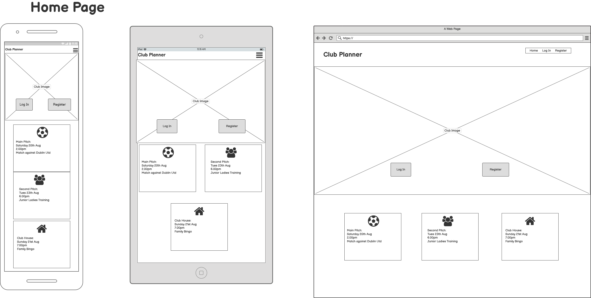
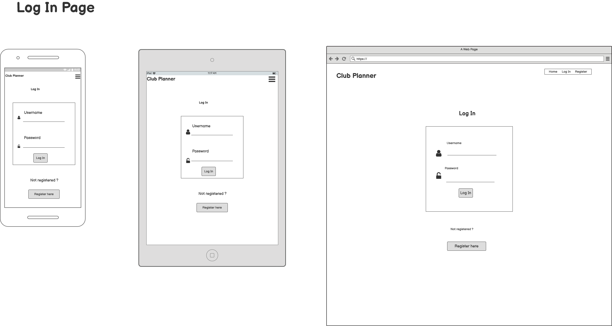
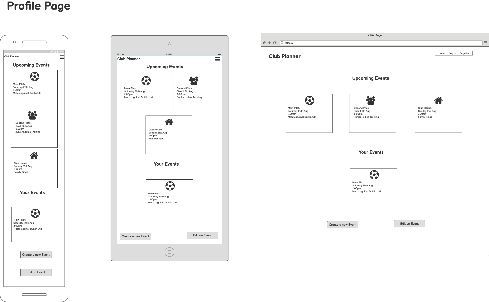
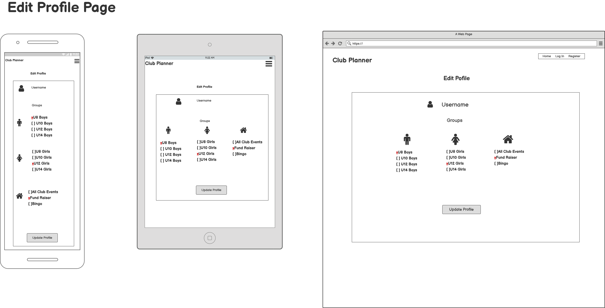
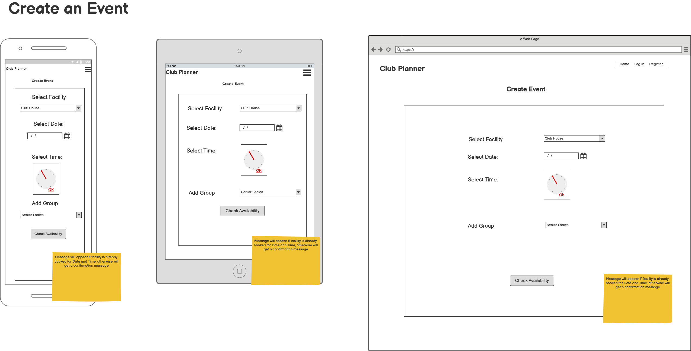
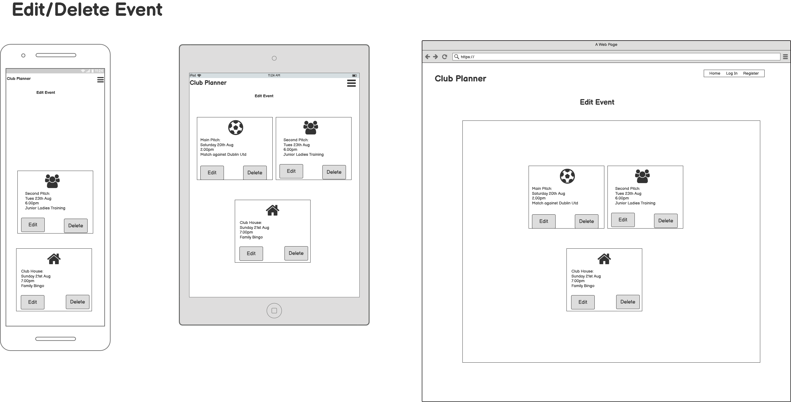
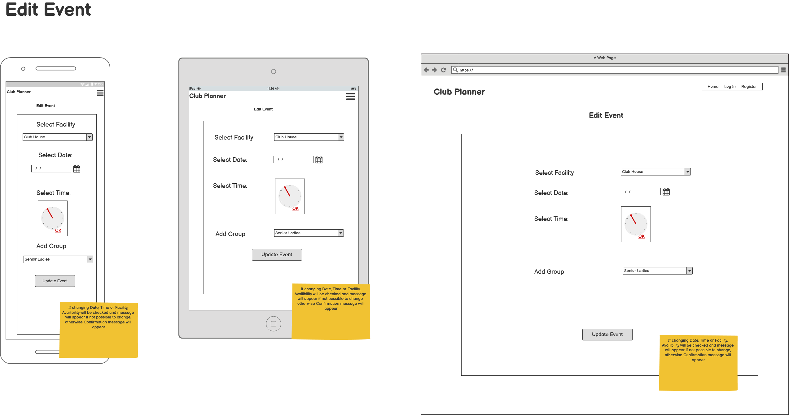
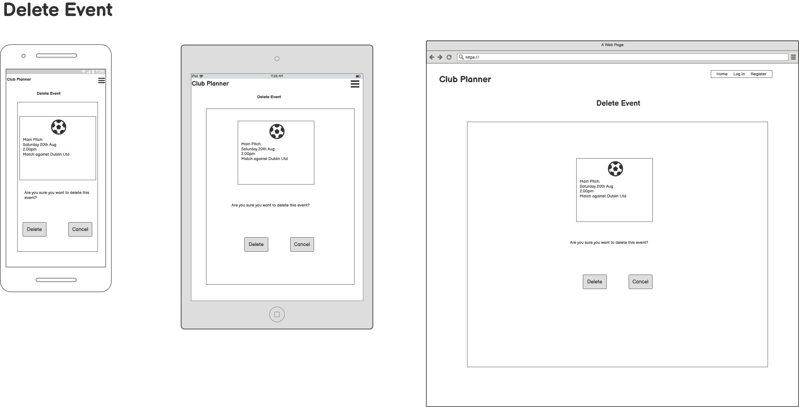

# Milestone Project 3
---
## Purpose

This site was designed for the third milestone project in Full Stack Software Development with the Code Institute, based on the learnings from HTML, CSS, Python and Flask Framework as Backend and MongoDB as the database.
![Site mockup]

---

## Club Planner

I decided to create an events planner site for a football club that I am involved with, to aid with the booking of the club facilities for training, meetings, matches
and other club activities. The idea being that this is centre location that users can access to view book events, view upcoming events and see the availability of
the various facilities..........
This project is based on the scheduling of activities for a Club (e.g. a Football Club), the idea being that users are able to book various events and 
the different facilities the club has. When creating an event, users are booking the required facility based on its availability and for specific groups. 
An example would be Senior Football training on Main pitch at a specific date and time. Users on registration, setup their profile with the groups that are 
relevant to them, so when an event is created within a specific group, this event will appear on their profile page once they log onto the site. 

This site could be easily modified to other clubs. 

 The live website can be found here: https://club-planner.herokuapp.com/

---

## Table of Contents
* [User Experience(UX)](#User-Experience)
    * [User Stories](#User-Stories)
    * [Structure](#Structure)
    * [Design](#Design)
        * [Colour Scheme](#Colour-Scheme)
        * [Typography](#Typography)
        * [Imagery](#Imagery)
        * [Wireframes](#Wireframes)

    * [Differences to Design](#Differences-to-Design)
    * [Features to be Implemented in Future](#Features-to-be-Implemented-in-Future)
* [Technologies Used](#Technologies-Used)
* [Testing](#Testing)
    * [Manual Testing](#Manual-Testing)
    * [User Stories Testing](#User-Stories-Testing)
    * [User Testing](#User-Testing)
    * [Validators](Validators)
* [Deployment](#Deployment)
    * [GitHub Project Creation](#GitHub-Project-Creation)
    * [Deploy with GitHub Pages](#Deploy-with-Github-Pages)
    * [Locally](Run-Locally)
* [Issues Encountered](#Issues-Encountered)
* [Credits](#Credits)
* [Acknowledgements](#Acknowledgements)

 The live website can be found here: https://club-planner.herokuapp.com/

---
### User Experience (UX)

#### User Stories:
*As a Guest User:*
* I want to immediately understand the nature of the site and learn more about the organisation.
* I want to be able to easily navigate through the site, with the structure of the content easy to follow.
* I want to easily log in to the site
* I want to easily be able to register.
* I want to be able to create my profile and select the groups that are relevant to me.
* I want to be able to access the site from all device types.

*Registered User:*
* I want to be able to log onto the website and see the events that are relevant to me.
* I want to be able to edit my profile by adding/removing groups that I am a member of.
* I want to be easily able to log out of my account.
* I want to be able to schedule events based on the availability of the facilities.
* I want to be able to create events.
* I want to be able to edit events that I have created.
* I want to be able delete the events that I have created.
* I want to be able to contact the site owner with any questions I may have in regards to the website.

## Structure:
Home Page – Will have a photo of the Club with buttons to Login and Register. Below this will be the next events for each facility.

Log in Page – For Registered users provides fields for inputting Username and Password. Will also display link for users not already registered.

Register Page – For New users shows fields for Username and Password to register for the site. Once registered they will be directed to the Edit Profile 
Page so that they can select the Groups relevant to them. Also, there will be a link for Users to login in case they have navigated to the wrong page.

Profile Page – When a User logs in the events that are relevant to them are displayed. There will be links for Creating an event and Editing an event.

Edit Profile – Change profile of user by selecting or deselecting Groups based on what events they want to know about. 

Schedule Event Page – Create an event using Dropdown for Facility, Date and Time Picker. Will also assign the Event to specific Group so that it will be 
displayed to members of that group. Availability will be checked to see if the required Time, Date and Facility have already been booked. 

Edit Event Page – Change a scheduled event by changing the specific fields. If a change to Facility, Date or Time is made, a check will take place to 
confirm the availability.

Delete Event Page – User will be asked if they are sure they want to delete an event. If they do then the event will be deleted and Facility, Date and 
Time will become available again.

## Design:

#### Colour scheme: 

#### Typography:

#### Imagery:
 

#### Wireframes:

Here is the wireframes that I used as the basis of the design
for the site. These were created using Balsamiq.

##### Home Page

##### Log In Page

##### Register Page

##### Profile Page

##### Edit Profile Page

##### Create Event Page

##### Edit/Delete Event Page

##### Edit Event Page

##### Delete Event Page

 For the pfd version of the wireframes click [here.](https://github.com/smeghen/clubplanner/blob/master/static/images/wireframes/MS3Wireframes.pdf)
 

### Differences to Design

### Features to be Implemented in Future

* Contact page with standard form for asking questions or passing on suggestions

---
## Technologies Used
* HTML -  HTML is the main language used for the structure of the site.
* CSS - Custom written CSS is used to style the site.
* Materialize – The layout and styling of the site was helped by the use of Materialize framework.
* Google Fonts -The font of Open Sans was imported from Google Fonts.
* Font Awesome – Was used to obtain the social media icons used.
* Balsamiq – Was used to create the wireframes of the site on the various devices.
* Adobe Photoshop Express - Used to resize images used on the site. https://www.adobe.com/ie/photoshop/online/resize-image.html
* Git - Git is used for the version control of changes throughout the project.
* GitPod – was used as the coding space for the project.
* Github - was used to host the project files and publish the live website by using Git Pages.
* Autoprefixer - was used to parse  CSS and add vendor prefixes to CSS rules via https://autoprefixer.github.io/
* W3 HTML Validation was done via https://validator.w3.org/
* W3 CSS Validation was done via https://jigsaw.w3.org/css-validator/
* Validation of JavaScript was done via https://jshint.com/
* Google Chrome DevTools – was used extensively during coding to check the responsiveness of the site with the addition of new features.
---
# Testing

The testing of this project was based on the layout of the site, the proper operation of buttons, dropdown menus, 
game play, user interaction and the responsiveness of the site on various device sizes.

#### Manual Testing

The following browsers were used to test the website – Google Chrome, Microsoft Edge and Safari.

For the testing of this project I devised a spreadsheet detailing the tests to be performed for the various pages and features.
Below is an image of a small section of this spreadsheet:

The full version of the spreadsheet can be downloaded [here.](https://github.com/smeghen/mathstables/blob/master/assets/images/MS2_Testing.xlsx)
Please note this is a .xlsx file and will require excel, google docs or compatiable program to open the file.
The testing was performed on PC, Tablet and Mobile devices and all tests passed. I have shown in the spreadsheet the tests
that caused issues and have included notes in relation to these. 

#### User Stories Testing

> I want to immediately understand the nature of the site and be able to easily navigate through the site.

This was addressed on the Home page with an explanation of the site in the centre of the page and 2 buttons to
navigate with:

> I want to be easily able to understand the rules of the game.

Within the Info modal all the information for the game is outlined:

> I want to be easily able to make a selection of the type of game to play.

The Game Select Modal is simple dropdown menus to select your options for the game to play:

> I want to know if my answer is correct or incorrect.

A correct answer is signalled to the user with a positive ping noise and their score increases by 1. 
With an incorrect answer there is a negative buzzer sound and a popup message:

> I want to track my progress during the game.

Progress is tracked with the score display, sounds and popups. 

> I want to be able to access the site from all device types.

The site was designed using the mobile first approach with the specfic understanding that the majority of users
would be accessing the game on either tablets or mobile phones. To aid the users in this respect I set the keyboard 
for these devices to default to number pad when in game play. This makes the game easier to play:

#### User Testing

Family members, peers of Slack and friends were asked to test the website and provide their thoughts on the user 
experience and any bugs that they found. Within this group of people the site was viewed on the following devices
 – Desktop, Laptop, iPad mini, iPad, iPhone 6, iPhone 8, Samsung Galaxy S6 and Huawei P30.

#### Validators

I used the  W3 HTML Validation and got only one error message:

As this is helping to validate that numbers are only entered by the user and it triggers the number keypad on small
screens, both of which aid in a better user experience, I choose to ignore the error.

W3 CSS Validation was used to check the CSS used for the site:

The two error messages relate to the Bootstrap cdn and are both out of my control.

JSHint was used to validate the JavaScript:

The undefined variables of $ relate to my use of a small bit of JQuery.

--- 

# Deployment

##  GitHub Project Creation
To create the project the following steps were used:

* In GitHub repositories section click the green 'New' button 
* Select the Code Institute template
* Name the repository and give a brief description
* Set repository to 'Public' to ensure the commit history is visible
* Click 'Create repository'
* Once created the workspace is built in Gitpod by clicking the Gitpod button.

## Deploy to Heroku
The website was deployed as follows:

* Navigate to Heroku.com and login.
* Click on the new button.
* Select create new app.
* Enter the app name.
* Select region.

Set up connection to Github Repository:

* Click the deploy tab and select GitHub - Connect to GitHub.
* A prompt to find a github repository to connect to will then be displayed.
* Enter the repository name for the project and click search.
* Once the repo has been found, click the connect button.

Set environment variables:

Click the settings tab and then click the Reveal Config Vars button and add the following:
* key: IP, value: 0.0.0.0
* key: PORT, value: 5000
* key: MONGO_DBNAME, value: (database name you want to connect to)
* key: MONGO_URI, value: (mongo uri - This can be found in MongoDB by going to clusters > connect > connect to your application and substituting the password and dbname that you set up in the link).
* key: SECRET_KEY, value: (This is a custom secret key set up for configuration to keep client-side sessions secure).

Enable automatic deployment:

* Click the Deploy tab
* In the Automatic deploys section, choose the branch you want to deploy from then click Enable Automation Deploys.

## Run Locally

The project will not run locally with database connections unless the user sets up an env.py file configuring 
IP, PORT, MONGO_URI, MONGO_DBNAME and SECRET_KEY. You must have the connection details in order to do this. 
These details are private and not disclosed in this repository for security purposes.

To run the code locally:

* Navigate to the repository
* Click the 'Code' drop down menu
* Select to copy the GitHub URL from HTTPS box or 'Download Zip'
* Open a new terminal and type 'git clone' command in the CLI and paste copied URL
* Alternatively, click 'Open with GitHub Desktop' and follow the steps to complete the clone

Once the project has been loaded, run the command 
> pip install -r requirements.txt 

  to install all the required packages.

---
# Issues Encountered 

* Getting the Create Event function to check the database for existing Events that had the same parameters of Date, Time and Facility proved tricky for me. But, with a bit of time 
and Slack research I came to understand the concepts that were required. What was throwing me was how to put each of the parameters into the search of the database. Once I understood 
that declaring the variables of date, time and venue from the input form, and then passing them into the search of the database, it all fell into place for me. 

* At first I assumed that the Edit Event function would work the same way as the Create Event, in that it would check the database for existing events with the same parameters of date, time 
and facility, but upon testing I found that a user could not update the group, description or name of the event. The issue was that the Create Event search on the database when used in the Edit
Event was actually just finding itself when the date, time and facility had not been edited and returning an Already booked message. The way around this was to put in an extra parameter
of  "_id": { "$ne": ObjectId(event_id)}. So now the check on the database is for date, time, facility and event id not equal to the id that is being edited, then the event cannot be booked.

# Credits

* Calendar image Photo by <a href="https://unsplash.com/@erothermel?utm_source=unsplash&utm_medium=referral&utm_content=creditCopyText">Eric Rothermel</a> 
on <a href="https://unsplash.com/s/photos/calendar?utm_source=unsplash&utm_medium=referral&utm_content=creditCopyText">Unsplash</a>

* Training image Photo by <a href="https://unsplash.com/@weareambitious?utm_source=unsplash&utm_medium=referral&utm_content=creditCopyText">Ambitious Creative Co.  
 Rick Barrett</a> on <a href="https://unsplash.com/s/photos/team-training?utm_source=unsplash&utm_medium=referral&utm_content=creditCopyText">Unsplash</a>

 * Postis image by <a href="https://unsplash.com/@epicantus?utm_source=unsplash&utm_medium=referral&utm_content=creditCopyText">Daria Nepriakhina</a> on <a href="https://unsplash.com/s/photos/post-it?utm_source=unsplash&utm_medium=referral&utm_content=creditCopyText">Unsplash</a>

 * Found this code for checking that there are results in the database for Events created by user, instead of using  https://stackoverflow.com/questions/65477524/flask-and-jinja-template-throwing-error-object-of-type-cursor-has-no-len

  
  

* Other images of club pitch and grounds taken by myself.

* The Task Manager Miniproject by Code Institute was used as an excellent starting point for this project. Much of the structure of the project was based around this and was adapted
, modified and expanded to suit the functionality of the porject.

* css styling for getting buttons centered in Materialize Parallax found on https://codepen.io/j_holtslander/pen/NoKqQP 

* Used site: https://www.programiz.com/python-programming/datetime go gain understandingof datetime, strptime and strftime functionality.

---

# Acknowledgments

* My Mentor, Precious Ijege , for his feedback and support throughout the project.

* The Slack community for their support, encouragement and assistance in finding answers 
to my project problems.