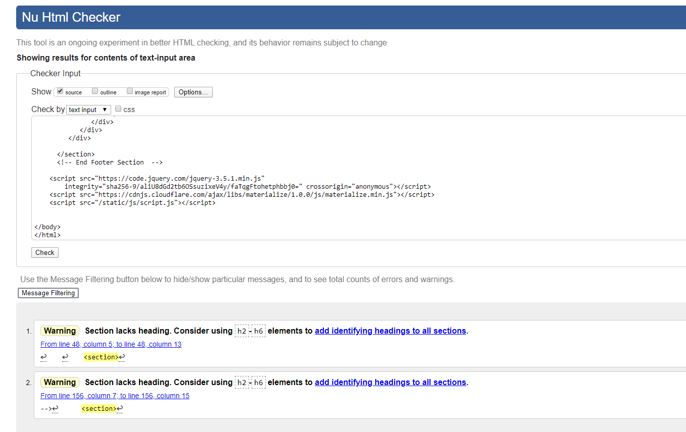
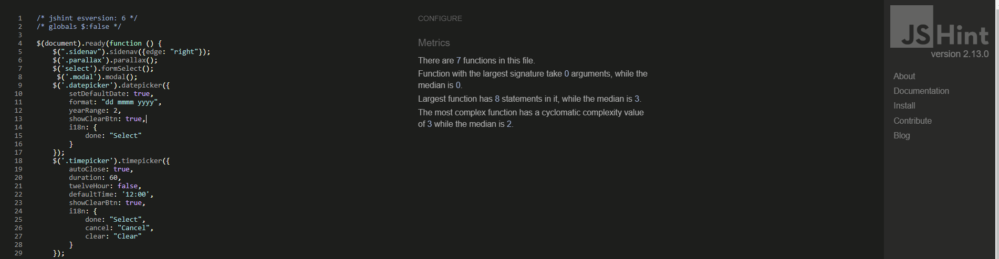

# Milestone Project 3
---
## Purpose

This site was designed for the third milestone project in Full Stack Software Development with the Code Institute, based on the learnings from HTML, CSS, Python and Flask Framework as Backend and MongoDB as the database.

---

## Club Planner

I decided to create an events planner site for a football club that I am involved with, to aid with the booking of the club facilities for training, meetings, matches
and other club activities. The idea being that this is a central location that users can access to view booked events, view upcoming events and see the availability of
the various facilities in this case Main Pitch, Training Pitch and the Club House.
When creating an event, users are booking the required facility based on its availability and for specific groups. 
An example would be Boys Under 10 Football training on Main pitch at a specific date and time, the application checks the database to see if there are any other
bookings for the selected facility on the date and time specified. In this this way there the possibility of double bookings is prevented. 

This site could be easily modified to other clubs, by modifying the styling of the site and creating a separate database which would be specific to the facilities of that club. 

 The live website can be found here: https://club-planner.herokuapp.com/

---

## Table of Contents
* [User Experience(UX)](#User-Experience)
    * [User Stories](#User-Stories)
    * [Structure](#Structure)
        * [Database Schema](#Database-Schema)
    * [Design](#Design)
        * [Colour Scheme](#Colour-Scheme)
        * [Imagery](#Imagery)
        * [Wireframes](#Wireframes)
    * [Differences to Design](#Differences-to-Design)
    * [Site Features](#Site-Features)
        * [Features to be Implemented in Future](#Features-to-be-Implemented-in-Future)
* [Technologies Used](#Technologies-Used)
* [Testing](#Testing)
    * [Manual Testing](#Manual-Testing)
    * [User Stories Testing](#User-Stories-Testing)
    * [User Testing](#User-Testing)
    * [Validators](Validators)
* [Deployment](#Deployment)
    * [GitHub Project Creation](#GitHub-Project-Creation)
    * [Deploy with GitHub Pages](#Deploy-with-Github-Pages)
    * [Locally](Run-Locally)
* [Issues Encountered](#Issues-Encountered)
* [Credits](#Credits)
* [Acknowledgements](#Acknowledgements)

 The live website can be found here: https://club-planner.herokuapp.com/

---
### User Experience (UX)

#### User Stories:
*As a Guest User:*
* I want to immediately understand the nature of the site and learn more about how to use it.
* I want to be able to easily navigate through the site, with the structure of the content easy to follow.
* I want to easily log in to the site
* I want to easily be able to register.
* I want to be able search the upcoming club events.
* I want to be able to access the site from all device types.

*Registered User:*
* I want to be able to log onto the website and see the events that I have created.
* I want to be easily able to log out of my account.
* I want to be able to create events.
* I want to be able to schedule events based on the availability of the facilities.
* I want to be able to edit events that I have created.
* I want to be able delete the events that I have created.

## Structure:

Below is a Site diagram that I used as a basis for the structure of the project:

#### Database Schema:

Below is the database schema that I devised for the project:

## Design:

#### Colour scheme: 
The colour scheme for the site consists of very neutral colours that do not over power the content of the site. I choose to utilize the standard Materialize colour palette
of brown lighten-5 for the cards on the Home page and Profile Page. Also, I used lighened versions of Red, Blue and Green for buttons throughout the site.

#### Imagery:
The Calendar image is by Eric Rothermel, which I obtained from Unsplash and used for both the Home and Profile pages. The background images for Login, Register and Create Event Pages, are pictures of 
the club grounds which I took myself. The Training image Photo by Ambitious Creative Co. Rick Barrett, obtained from Unsplash is used on the Edit event page.
 

#### Wireframes:

Here are the wireframes that I used as the basis of the design
for the site. These were created using [Balsamiq](https://balsamiq.com//).

##### Home Page

##### Log In Page

##### Register Page

##### Profile Page

##### Edit Profile Page

##### Create Event Page

##### Edit/Delete Event Page

##### Edit Event Page

##### Delete Event Page

 For the pfd version of the wireframes click [here.](https://github.com/smeghen/clubplanner/blob/master/static/images/wireframes/MS3Wireframes.pdf)
 

### Differences to Design

 * Home Page - I pretty much stuck to the my original design for the Home Page, I did change the Events being displayed to the next three events based on todays date. I also added an About Modal with 
 an explanation of the site, which is accessed from a button located on the parallax image. Finallly, I included a Search option below the displayed Events, so that users can search all the events 
 based on Facility, Name, Group Name and Description.

 * During the development process I decided to change the way of handling the User Profile based on the usability of the site and the added administration that would be required of a user for maintaining
 the Groups that they would be interested in. Based on this decision I totally removed the Edit Profile page from my design and consolidated the Profile page with the Edit/Delete Event Page. By doing this the Profile page now
 displays any events that a user has created, and within the card for each event is the option buttons to Edit or Delete the event. Also, added to the top of the page is a Create Event button. By making these changes I believe
 it makes it easier for users to navigate the site and control their Events.

## Site Features

Home Page – Calendar image with buttons to Login and Register. Below this will be the next events for each facility, and also a serach function to search the events that have been
created.

Log in Page – For Registered users provides fields for inputting Username and Password. Also displays link for users not already registered.

Register Page – For New users shows fields for Username and Password to register for the site. Once registered they will be directed to their Profile 
Page. Also, there is a link for Users to login in case they have navigated to the wrong page.

Profile Page – When a User logs in the Events that they have created will be displayed, or if they do not have any Events created notifying that there is none. 
There will be links for Creating an event and Editing an event. 

Create Event Page – Create an event using Dropdown for Facility, Date and Time Picker. Will also assign the Event to specific Group. Availability will be checked to see 
if the required Time, Date and Facility have already been booked. Messages are displayed if the Event is created or if the Facility is already booked.

Edit Event Page – Change a scheduled event by changing the specific fields. If a change to Facility, Date or Time is made, a check will take place to 
confirm the availability.

Delete Event Page – User will be asked if they are sure they want to delete an event. If they do then the event will be deleted and Facility, Date and 
Time will become available again.

### Features to be Implemented in Future

* Contact page with standard form for asking questions or passing on suggestions.
* A list diplaying bookings for each Facility sorted by Date, so that users at a glance will be able to see potential availability.
* Administration Function for assisting with Users that forget passwords or usernames. 
* Administration Function that has the permission to Edit or Delete any events, so that assistance can be given to Users.

---
## Technologies Used
* [HTML5](https://en.wikipedia.org/wiki/HTML5) -  HTML is the main language used for the structure of the site.
* [CSS](https://en.wikipedia.org/wiki/Cascading_Style_Sheets) - Custom written CSS is used to style the site.
* [Materialize](https://materializecss.com/) – The layout and styling of the site was helped by the use of Materialize framework.
* [JavaScript](https://en.wikipedia.org/wiki/JavaScript) - Utilized for form validation
* [jQuery](https://jquery.com/) - Used for various Materialize components such as, Datepicker, Timepicker, Dropdown menu, side navbar, parallax image and modal.
* [Python](https://www.python.org/) - Python is used as the back-end programming language.
* [Flask](https://flask.palletsprojects.com/en/1.1.x/) - Python microframework Flask is used to create this project.
* [Jinja](https://jinja.palletsprojects.com/en/2.11.x/) - Jinja templating language is used with Flask in the HTML code.
* [Werkzeug](https://werkzeug.palletsprojects.com/en/1.0.x/) - Werkzeug is used for password hashing and authentication and autohorization.
* [MobgoDB](https://www.mongodb.com/1) - Database used to create the document based collections for the data storage of this site.
* [Heroku](https://dashboard.heroku.com/) - Hosting platform to deploy the live site.
* [Font Awesome](https://fontawesome.com/) – Was used to obtain the social media icons used.
* [Balsamiq](https://balsamiq.com//)Balsamiq – Was used to create the wireframes of the site on the various devices.
* [Adobe Photoshop Express](https://www.adobe.com/ie/photoshop/online/resize-image.html) - Used to resize images used on the site. 
* [Git](https://git-scm.com/) - Git is used for the version control of changes throughout the project.
* [Gitpod](https://www.gitpod.io/) – was used as the coding space for the project.
* [GitHub](https://github.com/) - was used to host the project files and publish the live website by using Git Pages.
* [Autoprefixer](https://autoprefixer.github.io/) - was used to parse  CSS and add vendor prefixes to CSS rules.
* [W3C Markup Validation Service](https://validator.w3.org/) - W3C Markup Validation Service is used to check whether there were any errors in the HTML5 code.
* [W3C CSS validator](https://jigsaw.w3.org/css-validator/) - The W3C CSS validator is used to check whether there were any errors in the CSS3 code.
* [JShint](https://jshint.com/) - JavaScript validator that is used to check whether there were any errors in the JavaScript code.
* [PEP8](http://pep8online.com/) - The PEP8 validator is used to check whether there were any errors in the Python code.
* [Google Chrome Developer Tools](https://developers.google.com/web/tools/chrome-devtools) – was used extensively during coding to check the responsiveness of the site with the addition of new features.
---
# Testing

#### Manual Testing

#### User Stories Testing

> I want to immediately understand the nature of the site and learn more about how to use it.
* This is addressed in the short site description within the image on the Home page and the About modal that is accessed from the button also on the image on the home page.

> I want to be able to easily navigate through the site, with the structure of the content easy to follow.
* I kept the navigation of the site easy to use by duplicating the links on the navbar with buttons and having them located logically throughout the site, e.g. there is a Create Event button at the top of the Profile page.

> I want to easily log in to the site.

> I want to easily be able to register.
* Login and Register links are located on the navbar and buttons for both appear on the Home page image.

> I want to be able search the upcoming club events.
* There is a Search Function located on the Home page, and within it users can search for Events based on Title, Description, Facility and Group.

> I want to be able to access the site from all device types.
* The site was designed using the mobile first approach with the specfic understanding that the majority of users would be accessing the site on either tablets or mobile phones. 

> I want to be able to log onto the website and see the events that I have created.
* Once a user successfully logs in to the site they are automatically taken to their Profile page where the Events that they have created are displayed.

> I want to be easily able to log out of my account.
* A user can Log out of an account simply by selecting the Log Out navbar link, when logged out a confirmation message appears at the top of the screen.

> I want to be able to create events.

> I want to be able to schedule events based on the availability of the facilities.
* To navigate to the Create Event page the navbar can be used and also there is a button located at the top of a Users Profile page. Once on the page the user can then complete the required fields on 
the form to Create an Event. Once the form is submitted the site preforms a check on the database and will notify the user if the facility is not available to be booked.

> I want to be able to edit events that I have created.
* From the Profile page a user can select an Event that they have created and view the full details. There is a button to Edit the Event. This will bring the user to the Edit Event page, where they can 
make the required changes. 

> I want to be able delete the events that I have created.
* From the Profile page a user can select an Event that they have created and view the full details. There is a button to Delete the Event, by selecting this a warning modal appears and the suer can process or cancel.

#### User Testing

Family members, peers of Slack and friends were asked to test the website and provide their thoughts on the user 
experience and any bugs that they found. Within this group of people the site was viewed on the following devices
 – Desktop, Laptop, iPad mini, iPad, iPhone 6, iPhone 8, Samsung Galaxy S6 and Huawei P30.

* Some feedback that I received was in relation to the Datepicker and the fact that you could book events in the past. This capability could cause potential issues if Users incorrectly enter dates, to
prevent this from happening I put a minDate: new Date() into the Datepicker JS function, which sets the minimum date available to select as today. In this way past dates are not available for selection.

* When a user is logged in buttons to Register and Login still appear on the Home page parallax image. By using  was able to remove them from the page and with the  show all buttons to user not
logged in.

* Orginally on the Home page I had the Search option below the Event displayed, some users commented that it was too far down the page to find especially on smaller screens. To make it easier for users I moved it 
to below the Parallax image so that it is more accessible.

* Was observed on the Datepicker that for the long named months the letters were getting pushed behind the year. After checking on Dev Tools, was able to identify the style class involved and adjusted it so 
that full month name is now visible.

* Was found that by copying the url from one browrser to another for a logged in user then the login steps could be by past and changes could be made to events. I rectified this 
by adding a check for Profile, Create Event and Edit Event pages to confirm that user is in session then they can proceed, otherwise they are redirected to the login page.

#### Validators

I used the W3 HTML Validation and got only 2 warning messages:

These are warnings relating to heading elements in sections that are not relevant to the contain of the sections mentioned.

W3 CSS Validation was used to check the CSS used for the site:

The error message relates to the Materialize cdn which is below my control.

I used Pep8 Online for checking my Pyhton code. When I first checked it I got the following:

After going over the different issues highlighted I rechecked the code and got the below result:

JSHint was used to validate the JavaScript and jQuery:

--- 

# Deployment

##  GitHub Project Creation
To create the project the following steps were used:

* In GitHub repositories section click the green 'New' button 
* Select the Code Institute template
* Name the repository and give a brief description
* Set repository to 'Public' to ensure the commit history is visible
* Click 'Create repository'
* Once created the workspace is built in Gitpod by clicking the Gitpod button.

## Deploy to Heroku
The website was deployed as follows:

* Navigate to Heroku.com and login.
* Click on the new button.
* Select create new app.
* Enter the app name.
* Select region.

Set up connection to Github Repository:

* Click the deploy tab and select GitHub - Connect to GitHub.
* A prompt to find a github repository to connect to will then be displayed.
* Enter the repository name for the project and click search.
* Once the repo has been found, click the connect button.

Set environment variables:

Click the settings tab and then click the Reveal Config Vars button and add the following:
* key: IP, value: 0.0.0.0
* key: PORT, value: 5000
* key: MONGO_DBNAME, value: (database name you want to connect to)
* key: MONGO_URI, value: (mongo uri - This can be found in MongoDB by going to clusters > connect > connect to your application and substituting the password and dbname that you set up in the link).
* key: SECRET_KEY, value: (This is a custom secret key set up for configuration to keep client-side sessions secure).

Enable automatic deployment:

* Click the Deploy tab
* In the Automatic deploys section, choose the branch you want to deploy from then click Enable Automation Deploys.

## Run Locally

To run the code locally:

* Navigate to the repository
* Click the 'Code' drop down menu
* Select to copy the GitHub URL from HTTPS box or 'Download Zip'
* Open a new terminal and type 'git clone' command in the CLI and paste copied URL
* Alternatively, click 'Open with GitHub Desktop' and follow the steps to complete the clone

Once the project has been loaded, run the command 
> pip install -r requirements.txt 

  to install all the required packages.

The project will not run locally with database connections unless the user sets up an env.py file configuring 
IP, PORT, MONGO_URI, MONGO_DBNAME and SECRET_KEY. You must have the connection details in order to do this. 
These details are private and not disclosed in this repository for security purposes.

---
# Issues Encountered 

* Getting the Create Event function to check the database for existing Events that had the same parameters of Date, Time and Facility proved tricky for me. But, with a bit of time 
and Slack research I came to understand the concepts that were required. What was throwing me was how to put each of the parameters into the search of the database. Once I understood 
that declaring the variables of date, time and venue from the input form, and then passing them into the search of the database, it all fell into place for me. 

* At first I assumed that the Edit Event function would work the same way as the Create Event, in that it would check the database for existing events with the same parameters of date, time 
and facility, but upon testing I found that a user could not update the group, description or name of the event. The issue was that the Create Event search on the database when used in the Edit
Event was actually just finding itself when the date, time and facility had not been edited and returning an Already booked message. The way around this was to put in an extra parameter
of  "_id": { "$ne": ObjectId(event_id)}. So now the check on the database is for date, time, facility and event id not equal to the id that is being edited, then the event cannot be booked.

* To help highlight the text on the forms for creating and editing an event, I changed the colour to white to stand out over the background images. This worked well for all inputs, however for the Datepicker the 
Month and Date where not visible as it is a light coloured background. After a lot of research and trialing different solutions, I was able to resolve the issue with the use of Chrome Dev Tools, by selecting the items involved and finding the 
Materialize css classes that are controlling the colour and adding my own css styling to these classes.

# Credits

### Media

* Calendar image Photo by <a href="https://unsplash.com/@erothermel?utm_source=unsplash&utm_medium=referral&utm_content=creditCopyText">Eric Rothermel</a> 
on <a href="https://unsplash.com/s/photos/calendar?utm_source=unsplash&utm_medium=referral&utm_content=creditCopyText">Unsplash</a>

* Training image Photo by <a href="https://unsplash.com/@weareambitious?utm_source=unsplash&utm_medium=referral&utm_content=creditCopyText">Ambitious Creative Co.  
 Rick Barrett</a> on <a href="https://unsplash.com/s/photos/team-training?utm_source=unsplash&utm_medium=referral&utm_content=creditCopyText">Unsplash</a>

* Other images of club pitch and grounds taken by myself.

  
### Code

* The Task Manager Miniproject by Code Institute was used as an excellent starting point for this project. Much of the structure of the project was based around this and was adapted, 
modified and expanded to suit the functionality of the porject.

* Found this code for checking that there are results in the database for Events created by user, instead of using  https://stackoverflow.com/questions/65477524/flask-and-jinja-template-throwing-error-object-of-type-cursor-has-no-len

* CSS styling for getting buttons centered in Materialize Parallax found on https://codepen.io/j_holtslander/pen/NoKqQP 

* Got help adding a background overlay shadow to darken the background image here https://stackoverflow.com/questions/36679649/how-to-add-a-color-overlay-to-a-background-image

* Used site: https://www.programiz.com/python-programming/datetime go gain understanding of datetime, strptime and strftime functionality.

* Found the solution to vaildating inputs for Event Name and Description by preventing the usering entering just blank spaces from:
 https://www.freecodecamp.org/news/how-to-check-if-an-input-is-empty-with-css-1a83715f9f3e/

---

# Acknowledgments

* My Mentor, Precious Ijege , for his feedback and support throughout the project.

* The Slack community for their support, encouragement and assistance in finding answers 
to my project problems.