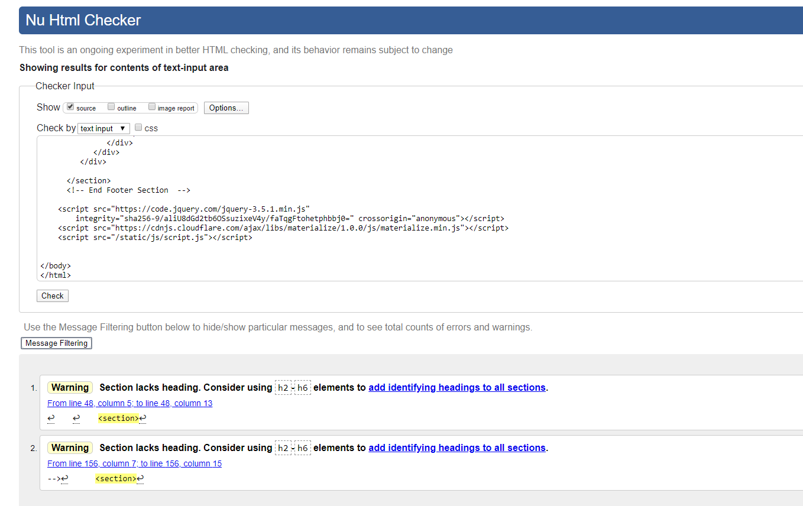
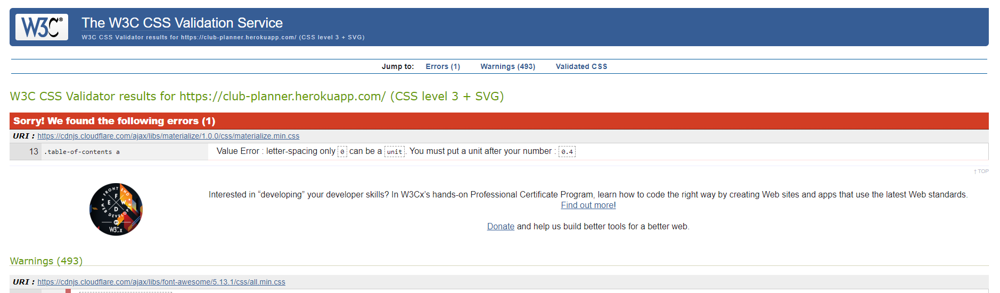
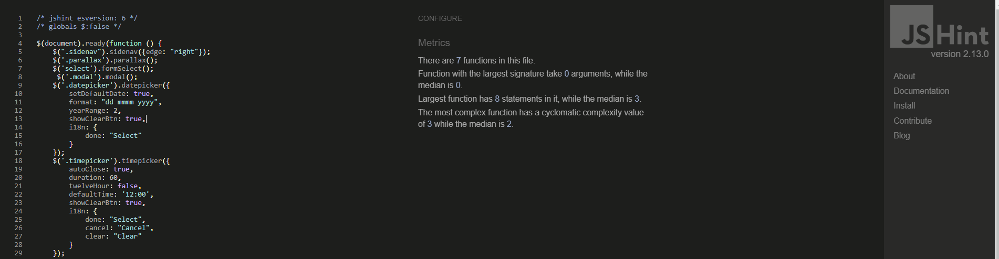
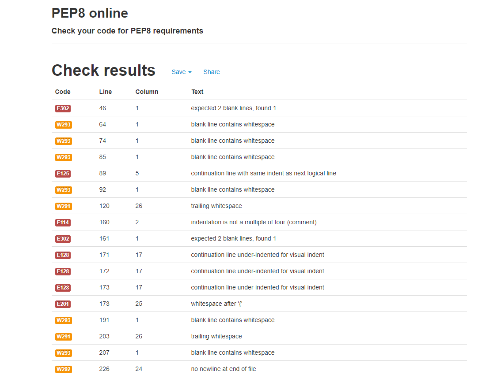
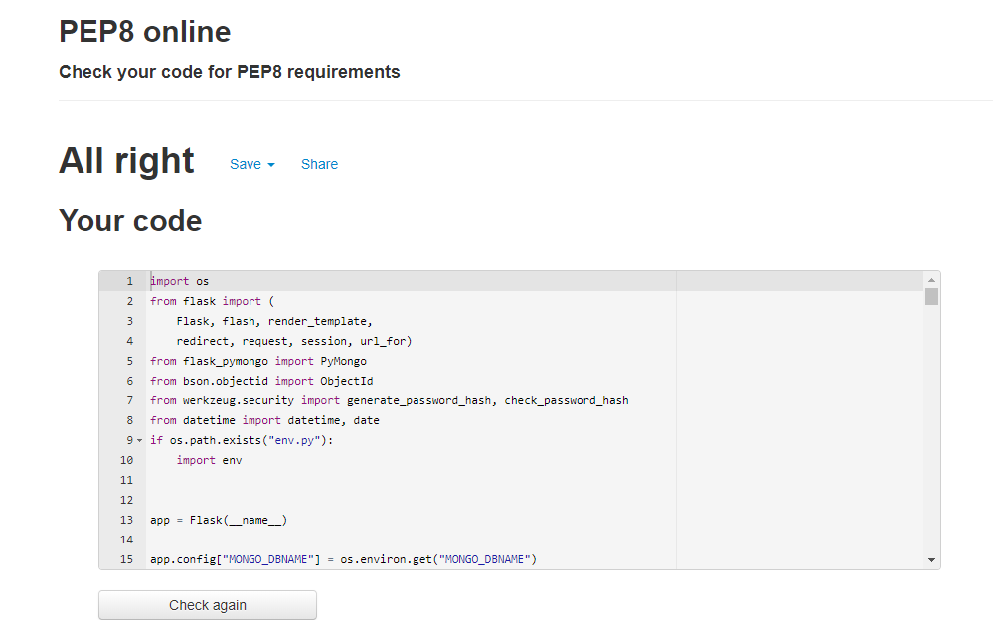
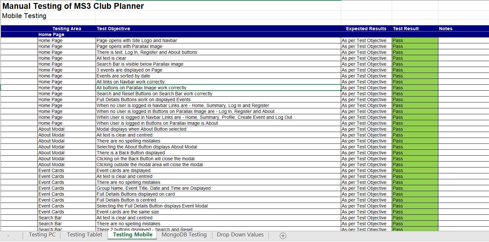

# Testing

## Table of Contents

* [Validators](Validators)
* [Manual Testing](#Manual-Testing)
* [User Stories Testing](#User-Stories-Testing)
* [User Testing](#User-Testing)
* [Issues Encountered](#Issues-Encountered)

---

## Validators
 - **[HTML Validator](https://validator.w3.org/):** No errors found.
    - With testing the HTML code, the jinja templating was causing issues.
    - I tested the HTML code by using chrome Dev Tools on the deployed site and capturing the source html. This code was then passed through the validator.
    - The below warning messages were found for all pages. I chose to ignore them as they are not errors and by not adding headings did not impact the overall site layout.

    

- **[CSS Validator](https://jigsaw.w3.org/css-validator/):** One error message.
    - The error message relates to the Materialize cdn which is below my control.

- **[JS Hint](https://jshint.com/):** No errors found.

- **[Python validator | PEP8](http://pep8online.com/):** When I first checked it I got the following:

After going over the different issues highlighted I rechecked the code and got the below result:

--- 

## Manual Testing

The following browsers were used to test the website – Google Chrome, Microsoft Edge and Safari.

For the testing of this project I devised a spreadsheet detailing the tests to be performed for the various pages and features.
Below is an image of a small section of this spreadsheet:

The full version of the spreadsheet can be downloaded [here.](https://github.com/smeghen/clubplanner/blob/master/static/images/testing/MS3_Testing.xlsx)
Please note this is a .xlsx file and will require excel, google docs or compatiable program to open the file.
The testing was performed on PC, Tablet and Mobile devices and all tests passed. I have shown in the spreadsheet the tests
that caused issues and have included notes in relation to these.

---

## User Stories Testing

> I want to immediately understand the nature of the site and learn more about how to use it.
* This is addressed in the short site description within the image on the Home page and the About modal that is accessed from the button also on the image on the home page.

> I want to be able to easily navigate through the site, with the structure of the content easy to follow.
* I kept the navigation of the site easy to use by duplicating the links on the navbar with buttons and having them located logically throughout the site, e.g. there is a Create Event button at the top of the Profile page.

> I want to easily log in to the site.

> I want to easily be able to register.
* Login and Register links are located on the navbar and buttons for both appear on the Home page image.

> I want to be able search the upcoming club events.
* There is a Search Function located on the Home page, and within it users can search for Events based on Title, Description, Facility and Group.

> I want to be able to access the site from all device types.
* The site was designed using the mobile first approach with the specfic understanding that the majority of users would be accessing the site on either tablets or mobile phones. 

> I want to be able to log onto the website and see the events that I have created.
* Once a user successfully logs in to the site they are automatically taken to their Profile page where the Events that they have created are displayed.

> I want to be easily able to log out of my account.
* A user can Log out of an account simply by selecting the Log Out navbar link, when logged out a confirmation message appears at the top of the screen.

> I want to be able to create events.

> I want to be able to schedule events based on the availability of the facilities.
* To navigate to the Create Event page the navbar can be used and also there is a button located at the top of a Users Profile page. Once on the page the user can then complete the required fields on 
the form to Create an Event. Once the form is submitted the site preforms a check on the database and will notify the user if the facility is not available to be booked.

> I want to be able to edit events that I have created.
* From the Profile page a user can select an Event that they have created and view the full details. There is a button to Edit the Event. This will bring the user to the Edit Event page, where they can 
make the required changes. 

> I want to be able delete the events that I have created.
* From the Profile page a user can select an Event that they have created and view the full details. There is a button to Delete the Event, by selecting this a warning modal appears and the suer can process or cancel.

---

## User Testing

Family members, peers of Slack and friends were asked to test the website and provide their thoughts on the user 
experience and any bugs that they found. Within this group of people the site was viewed on the following devices
 – Desktop, Laptop, iPad mini, iPad, iPhone 6, iPhone 8, Samsung Galaxy S6 and Huawei P30.

* Some feedback that I received was in relation to the Datepicker and the fact that you could book events in the past. This capability could cause potential issues if Users incorrectly enter dates, to
prevent this from happening I put a minDate: new Date() into the Datepicker JS function, which sets the minimum date available to select as today. In this way past dates are not available for selection.

* When a user is logged in buttons to Register and Login still appear on the Home page parallax image. By using  was able to remove them from the page and with the  show all buttons to user not
logged in.

* Orginally on the Home page I had the Search option below the Event displayed, some users commented that it was too far down the page to find especially on smaller screens. To make it easier for users I moved it 
to below the Parallax image so that it is more accessible.

* Was observed on the Datepicker that for the long named months the letters were getting pushed behind the year. After checking on Dev Tools, was able to identify the style class involved and adjusted it so 
that full month name is now visible.

* Was found that by copying the url from one browrser to another for a logged in user then the login steps could be by past and changes could be made to events. I rectified this 
by adding a check for Profile, Create Event and Edit Event pages to confirm that user is in session then they can proceed, otherwise they are redirected to the login page.

* One User asked for a page to view events so that you could check availability of a facility before going to the Create page. Based on this feedback I created a Summary page which 
displays list of all upcoming events sorted by date. Displayed for each event is the Facility, Event Name, Date and Time, so that at a glance users can see what is coming up. 

---

## Issues Encountered 

* Getting the Create Event function to check the database for existing Events that had the same parameters of Date, Time and Facility proved tricky for me. But, with a bit of time 
and Slack research I came to understand the concepts that were required. What was throwing me was how to put each of the parameters into the search of the database. Once I understood 
that declaring the variables of date, time and venue from the input form, and then passing them into the search of the database, it all fell into place for me. 

* At first I assumed that the Edit Event function would work the same way as the Create Event, in that it would check the database for existing events with the same parameters of date, time 
and facility, but upon testing I found that a user could not update the group, description or name of the event. The issue was that the Create Event search on the database when used in the Edit
Event was actually just finding itself when the date, time and facility had not been edited and returning an Already booked message. The way around this was to put in an extra parameter
of  "_id": { "$ne": ObjectId(event_id)}. So now the check on the database is for date, time, facility and event id not equal to the id that is being edited, then the event cannot be booked.

* To help highlight the text on the forms for creating and editing an event, I changed the colour to white to stand out over the background images. This worked well for all inputs, however for the Datepicker the 
Month and Date where not visible as it is a light coloured background. After a lot of research and trialing different solutions, I was able to resolve the issue with the use of Chrome Dev Tools, by selecting the items involved and finding the 
Materialize css classes that are controlling the colour and adding my own css styling to these classes.

---

[Go to README.md file](README.md).

---

